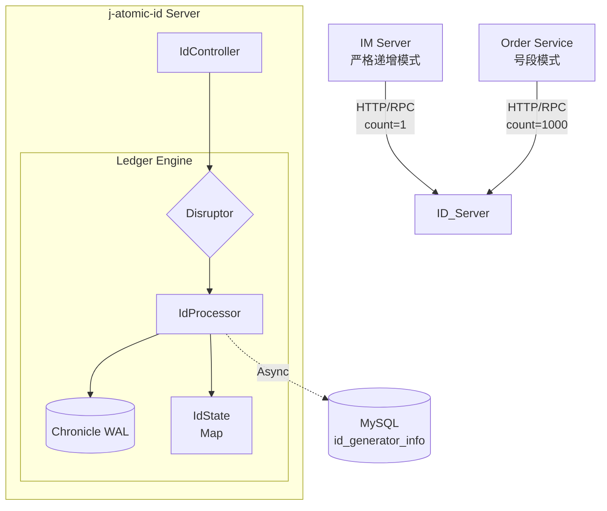
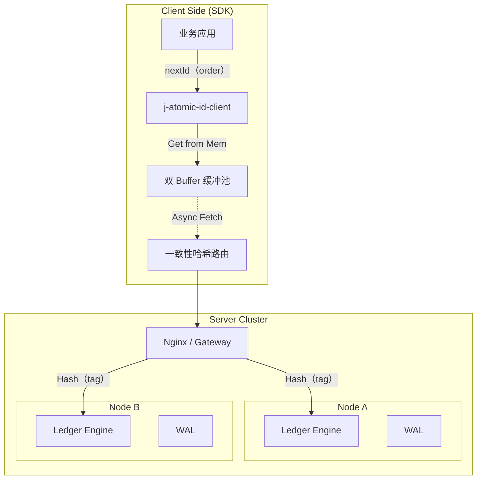
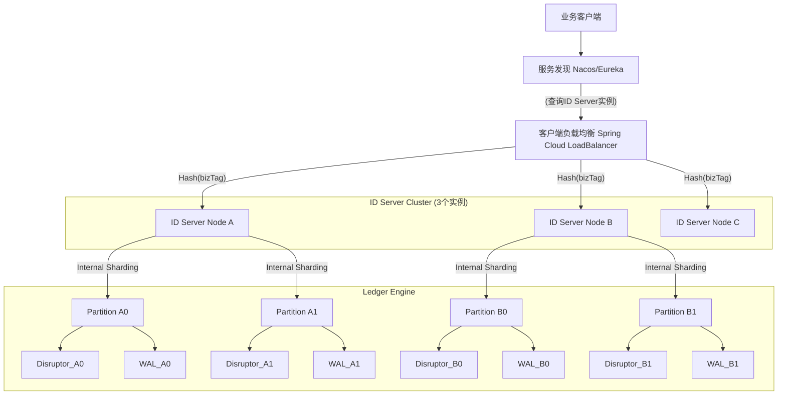
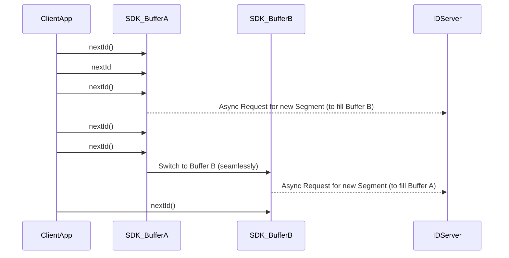
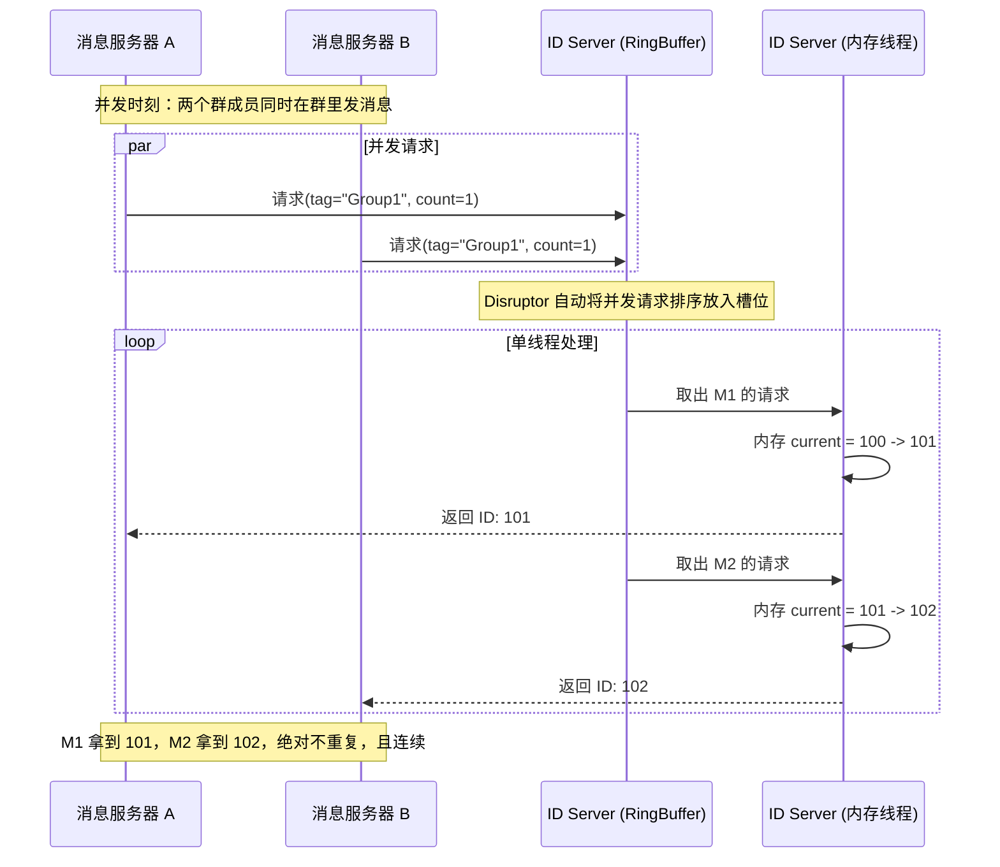
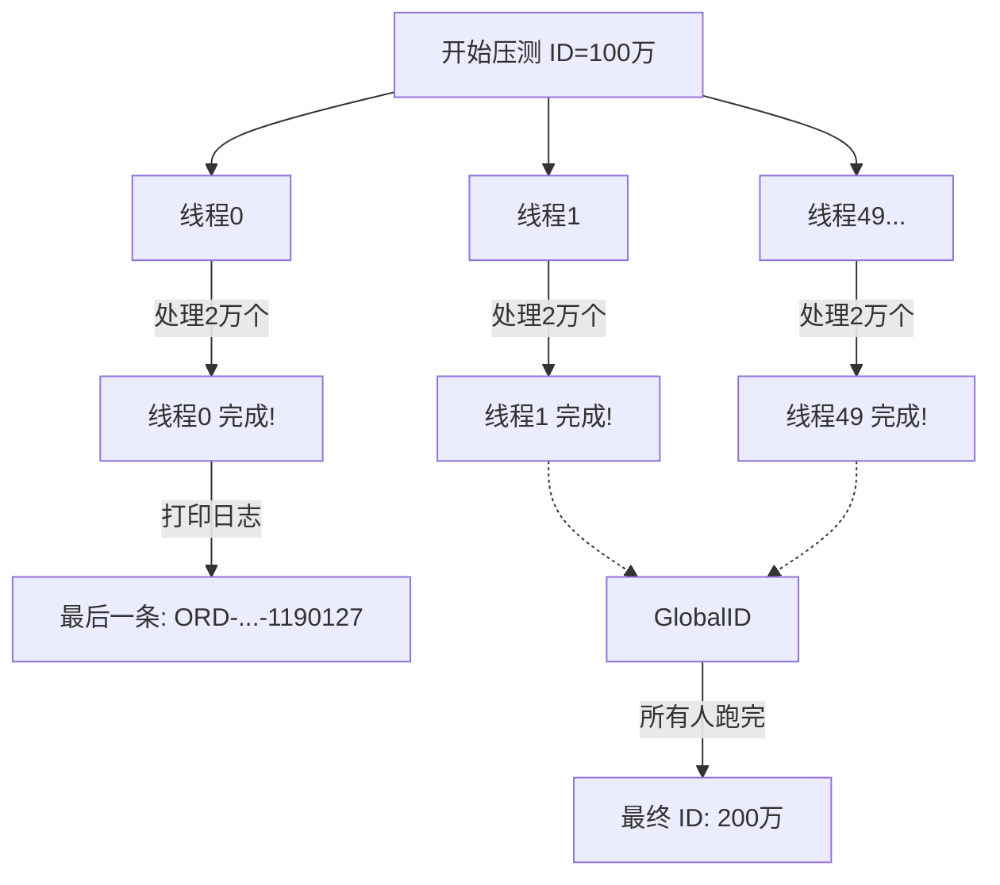

# j-atomic-id
一款基于 j-atomic-ledger 核心引擎的高性能分布式 ID 生成器。支持 IM 消息严格递增 与 订单号段 双模式，单机千万级 TPS。解决雪花算法时钟回拨痛点，提供纳秒级发号能力。  
A high-performance distributed ID generator built on j-atomic-ledger. Supports Strict Sequential (IM) and Segment (Order) modes with million-level TPS. Solves Snowflake clock rollback issues with nanosecond-level latency.

### j-atomic-id 服务器端架构图

### j-atomic-id 客户端 SDK 架构图

### j-atomic-id Server 集群部署架构图

### j-atomic-id-client 号段模式双Buffer时序图

### j-atomic-id-client IM模式时序图

## 🛠️ Prerequisites / 部署前置要求

Before starting the server, you must initialize the MySQL database.
启动服务前，请务必初始化 MySQL 数据库。

1.  **Execute SQL Script / 执行 SQL 脚本**:
    Run `scripts/schema.sql` in your MySQL instance to create the database and table.
    在 MySQL 中执行 `scripts/schema.sql` 以创建库表。

2.  **Configure DB Connection / 配置数据库连接**:
    Update `spring.datasource` settings in `application.yml`.
    修改 `application.yml` 中的数据库连接信息。