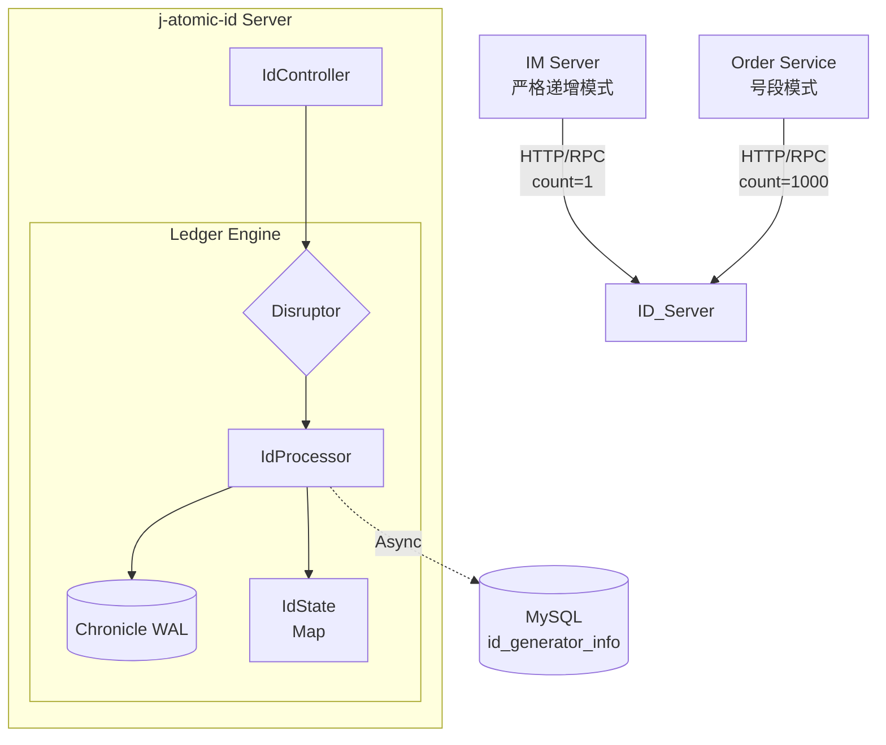
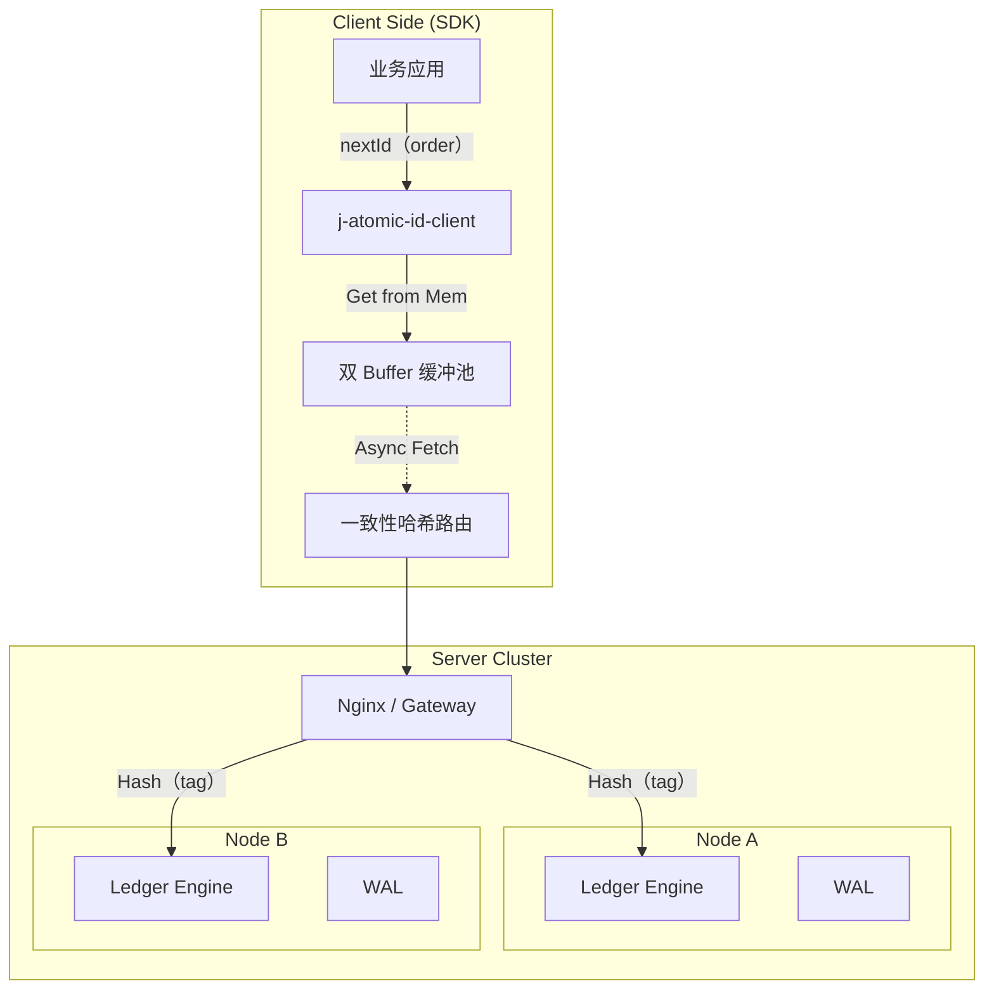
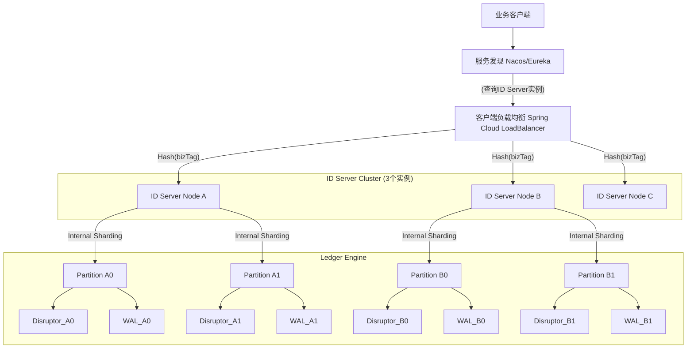
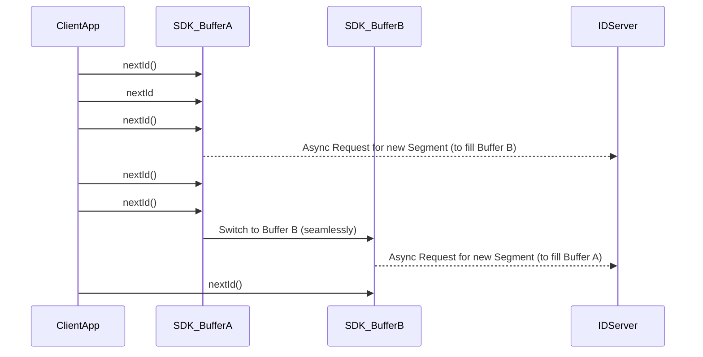

# j-atomic-id
一款基于 j-atomic-ledger 核心引擎的高性能分布式 ID 生成器。支持 IM 消息严格递增 与 订单号段 双模式，单机千万级 TPS。解决雪花算法时钟回拨痛点，提供纳秒级发号能力。  
A high-performance distributed ID generator built on j-atomic-ledger. Supports Strict Sequential (IM) and Segment (Order) modes with million-level TPS. Solves Snowflake clock rollback issues with nanosecond-level latency.

### j-atomic-id 服务器端架构图

### j-atomic-id 客户端 SDK 架构图

### j-atomic-id Server 集群部署架构图

### j-atomic-id 客户端双 Buffer 架构图

